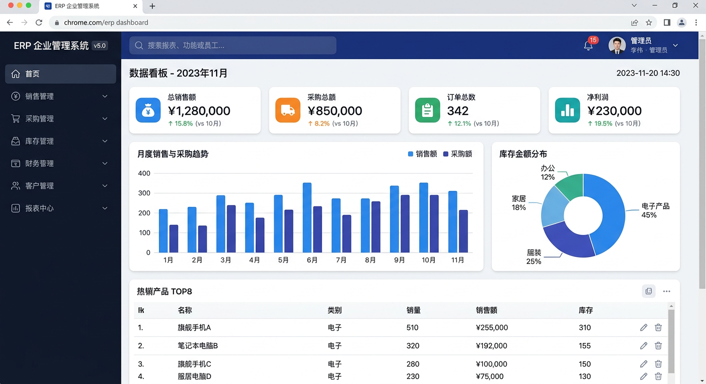
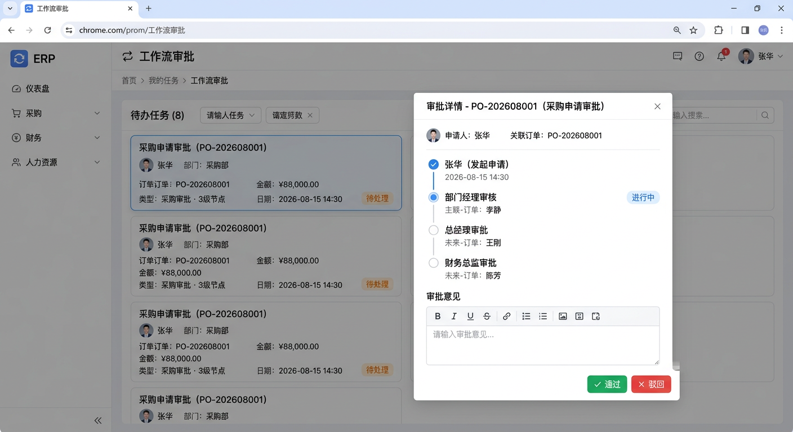
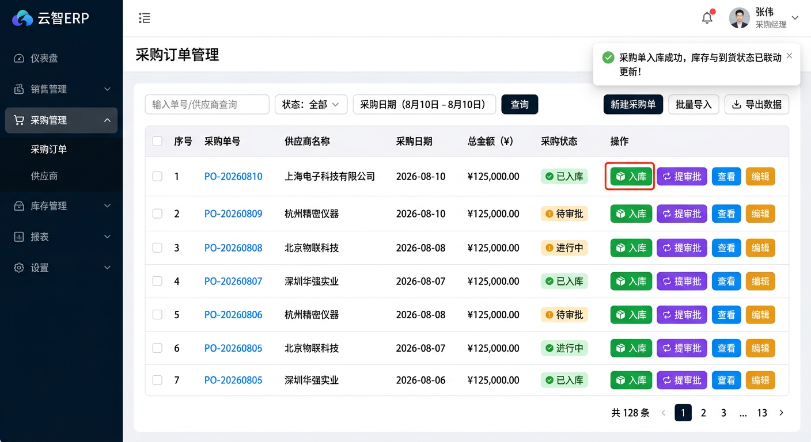
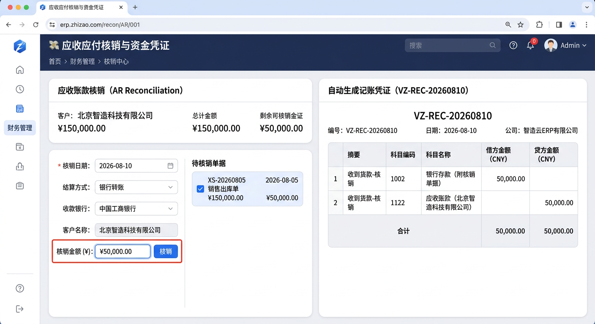
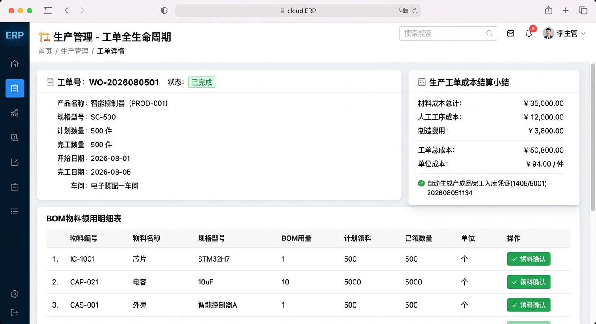
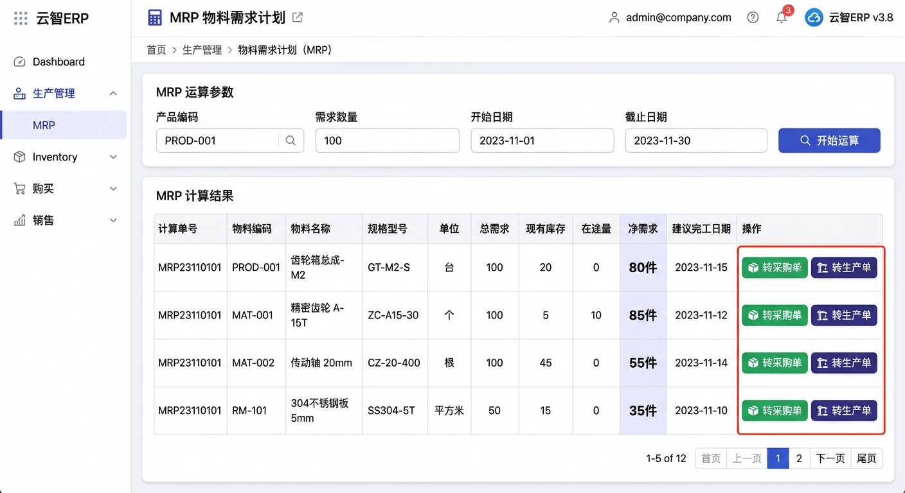

# 📘 ERP 企业管理系统 v5.0 功能介绍与操作手册

> **版本**：v5.0  
> **技术架构**：React 19.2 + TypeScript 5.9 + Vite 7 + Tailwind CSS 4 + Spring Boot 2.7 + MySQL  
> **核心特色**：全流程端到端打通、单据智能联动、资金凭证实时结转、MRP 净需求运算拉起、162 张业务表完整实体模型。

---

## 目录

1. [系统概述与核心优势](#1-系统概述与核心优势)
2. [预置账号与权限对照](#2-预置账号与权限对照)
3. [核心业务模块操作与界面指南 (含图解)](#3-核心业务模块操作与界面指南-含图解)
   - [3.1 📊 数据驾驶舱控制台 (Dashboard)](#31--数据驾驶舱控制台-dashboard)
   - [3.2 📈 报表中心 (Report Center)](#32--报表中心-report-center)
   - [3.3 🔁 工作流审批引擎 (Workflow Engine)](#33--工作流审批引擎-workflow-engine)
   - [3.4 🛒 进销存单据与智能出入库联动 (Trade & Stock Linkage)](#34--进销存单据与智能出入库联动-trade--stock-linkage)
   - [3.5 💸 应收应付核销与资金凭证生成 (Reconciliation)](#35--应收应付核销与资金凭证生成-reconciliation)
   - [3.6 🏗️ 生产管理全生命周期 (Production Management)](#36--生产管理全生命周期-production-management)
   - [3.7 🧮 MRP 物料需求运算与智能转单 (MRP Calculation)](#37--mrp-物料需求运算与智能转单-mrp-calculation)
   - [3.8 🛠️ 库存直调 & 期末关账 (Inventory & Closing)](#38--库存直调--期末关账-inventory--closing)
   - [3.9 📒 会计凭证总账管理 (Voucher Management)](#39--会计凭证总账管理-voucher-management)
   - [3.10 📊 三大财务报表 (Financial Statements)](#310--三大财务报表-financial-statements)
   - [3.11 💰 财务模版库与表单导出 (Finance Templates)](#311--财务模版库与表单导出-finance-templates)
   - [3.12 👤 用户管理与 RBAC 矩阵 (Users & RBAC)](#312--用户管理与-rbac-矩阵-users--rbac)
   - [3.13 🏢 ERP 系统底层主数据基座与实体模型 (Master Data Backbone)](#313--erp-系统底层主数据基座与实体模型-master-data-backbone)
4. [全流程数据联动矩阵](#4-全流程数据联动矩阵)
5. [常见问题与操作最佳实践](#5-常见问题与操作最佳实践)

---

## 1. 系统概述与核心优势

ERP 企业管理系统 v5.0 覆盖企业运营全流程，实现**进销存、生产制造、协同审批、财务总账与资金核销**的完整闭环。

### 🌟 核心优势与易用性设计

* **极简易用，无需繁琐培训**：
  - 区别于传统 heavy ERP（如 SAP、金蝶、用友）层层嵌套的深层菜单，本系统采用**“可视化控制台 + 12 个专注业务场景的专属界面”**，操作极其直观。
* **数据深度联动，拒绝数据孤岛**：
  - **采购**：采购单一键入库 ➔ 自动算加权平均成本 ➔ 更新库存余额与到货状态 ➔ 挂接应付账款。
  - **销售**：销售单一键出库 ➔ 动态扣减库存 ➔ **自动生成销售成本凭证（借:6401主营业务成本 贷:1405库存商品）** ➔ 更新发货状态。
  - **核销**：应收应付一键核销 ➔ 自动生成银行存款记账凭证（借/贷 1002/1122/2202）➔ 实时同步更新总账科目余额。
  - **MRP 运算**：BOM 净需求计算后，支持一键拉起采购订单或生产工单。
  - **审批**：费用审批通过后自动生成记账凭证（借:6602管理费用 贷:1002银行存款）。
* **中文场景优化与安全保障**：
  - **多层权限防护**：前端 JSON 权限 + 后端模块前缀强校验 + RBAC 菜单矩阵。
  - **高并发行锁**：库存扣减采用 MySQL `FOR UPDATE` 行排他锁，防止超扣与数据竞争。
  - **UTF-8 BOM CSV 导出**：所有数据表及报表 CSV 导出均注入 UTF-8 BOM，在 Windows 中文 Excel 下打开绝无乱码。

---

## 2. 预置账号与权限对照

系统提供 8 个不同角色的内置测试账号，密码统一，登录后菜单根据角色权限自动过滤：

| 用户名 | 默认密码 | 角色 | 所属部门 | 核心菜单与功能权限 |
|---|---|---|---|---|
| **admin** | `admin123` | **主账号（管理员）** | 管理层 | **全部 13 个业务页面** + 用户管理 + RBAC 矩阵 |
| **zhangsan** | `123456` | 销售 | 销售部 | 工作流审批 / 销售单据管理 / 销售一键出库 |
| **zhouba** | `123456` | 采购 | 采购部 | 工作流审批 / 采购单据管理 / 采购一键入库 |
| **lisi** | `123456` | 仓管 | 仓储部 | 工作流审批 / 生产管理 / 库存直调&期末 |
| **zhaoliu** | `123456` | 生产 | 生产部 | 工作流审批 / 生产管理 / MRP运算 |
| **wangwu** | `123456` | 会计 | 财务部 | 工作流审批 / 会计凭证 / 三大财务报表 / 应收应付核销 / 库存结账 |
| **sunqi** | `123456` | 人事 | 人事部 | 工作流审批 / 人力资源管理 |
| **wujiu** | `123456` | 售后 | 售后部 | 工作流审批 / 售后服务单 |

---

## 3. 核心业务模块操作与界面指南 (含图解)

### 3.1 📊 数据驾驶舱控制台 (Dashboard)

* **功能路径**：左侧导航 ➔ 控制台
* **业务界面示意图**：

* **核心操作指南**：
  - **KPI 经营指标**：顶部展示实时销售总额、采购总额、总订单数与净利润，数据随着出入库与核销实时动态变动。
  - **销售/采购趋势**：查看月度与周度的销售与采购对比柱状图，直观感知企业经营体量。
  - **库存金额分布**：环形图呈现各商品类目的存货资金占用情况。

---

### 3.2 📈 报表中心 (Report Center)

* **功能路径**：左侧导航 ➔ 报表中心
* **核心操作指南**：
  - 提供 **销售、采购、库存、财务、生产、人力** 六个维度的综合报表。
  - 支持按 **周 (Weekly)、月 (Monthly)、年 (Yearly)** 自由切换图表维度，数据直接从 MySQL 数据库实时计算展示。

---

### 3.3 🔁 工作流审批引擎 (Workflow Engine)

* **功能路径**：左侧导航 ➔ 业务操作 ➔ 工作流审批
* **业务界面示意图**：

* **核心操作指南**：
  1. **单据直接提审批**：采购员在【采购订单】列表中点击行操作栏 **`🔁 提审批`**，一键推送至工作流，系统自动带入关联单号与总金额。
  2. **多级审批流转**：
     - **采购审批**：3 级（部门经理 ➔ 总经理 ➔ 财务总监）。
     - **费用审批**：2 级（部门经理 ➔ 财务审核）。
     - **请假审批**：2 级（部门经理 ➔ HR复核）。
  3. **审节点处理**：审批人在“我的待办”中点击【详情】，弹窗展示多级流转节点与日志，输入意见后点击【通过】或【驳回】。
  4. **账务自动联动**：费用审批通过终结时，系统在写入 `finance_expense_main` 的同时，**自动生成费用记账凭证（借:6602管理费用 贷:1002银行存款）** 并同步更新科目余额！

---

### 3.4 🛒 进销存单据与智能出入库联动 (Trade & Stock Linkage)

* **功能路径**：左侧导航 ➔ 数据模块 ➔ 进销存管理 ➔ 采购订单 / 销售订单
* **业务界面示意图**：

* **核心操作指南**：

#### 采购到入库全联动
1. 采购人员在 `trade_purchase_main` 保存采购单。
2. 货物送达仓库后，仓管人员在列表行点击 **`📦 入库`**：
   - 自动生成入库主明细单据 (`trade_stock_in_main/detail`)。
   - **自动计算加权平均成本**，更新库存余额并写入 `trade_stock_log` 日志。
   - 同步更新物料主表 (`trade_goods_main`) 的单位成本与最新采购价。
   - 采购单状态自动更改为 `'已入库'`，到货状态更改为 `'全部到货'`。

#### 销售到出库与成本结转全联动
1. 销售人员在 `trade_sales_main` 保存销售单。
2. 仓库发货时，在列表行点击 **`🚚 出库`**：
   - 系统自动校验库存（若库存不足弹出精确缺货数量提示）。
   - 自动生成出库单据 (`trade_stock_out_main/detail`)，并采用行级锁扣减实际库存。
   - **自动结转销售成本会计凭证**：根据出库商品当前单位成本，自动生成凭证 借：`6401` 主营业务成本，贷：`1405` 库存商品，并实时更新总账科目余额。
   - 销售单状态自动更新为 `'已出库'` 和 `'已完成'`。

---

### 3.5 💸 应收应付核销与资金凭证生成 (Reconciliation)

* **功能路径**：左侧导航 ➔ 业务操作 ➔ 应收应付核销
* **业务界面示意图**：

* **核心操作指南**：
  1. 页面分别列出客户应收账款与供应商应付账款清单。
  2. 在单据行右侧输入本次核销金额（支持部分核销与全额核销），点击【核销】。
  3. **自动化联动结果**：
     - 更新对应单据的已收/已付金额与状态（`已核销` / `部分核销`）。
     - 自动向资金流水表（`finance_income_main` / `finance_expense_main`）写入核销记录。
     - **自动生成资金记账凭证**：
       - 应收核销：借 `1002 银行存款`，贷 `1122 应收账款`。
       - 应付核销：借 `2202 应付账款`，贷 `1002 银行存款`。
     - 实时增减 `account_subject_balance` 中银行存款与应收应付科目的借贷发生额与期末余额！

---

### 3.6 🏗️ 生产管理全生命周期 (Production Management)

* **功能路径**：左侧导航 ➔ 业务操作 ➔ 生产管理
* **业务界面示意图**：

* **核心操作指南**：
  1. **创建工单**：输入产品编码与计划数量，系统自动根据 BOM 结构（`prod_bom_structure`）进行展算，生成对应的领料单 (`prod_material_requisition`)。
  2. **领料确认**：在领料确认区确认领料数量，系统**自动扣减原材料库存**，并生成直接材料记账凭证（借：`5001 生产成本`，贷：`1403 原材料`）。
  3. **报废登记**：如有生产损耗，录入报废数量与原因。
  4. **完工入库与成本结算**：录入实际完工入库量，系统自动增加产成品库存；完工时自动汇总材料成本与工序成本，**生成完工入库凭证（借:1405库存商品 贷:5001生产成本）**，并将最新单位成本同步更新至商品主表。

---

### 3.7 🧮 MRP 物料需求运算与智能转单 (MRP Calculation)

* **功能路径**：左侧导航 ➔ 业务操作 ➔ MRP 运算
* **业务界面示意图**：

* **核心操作指南**：
  1. 在“MRP 运算”区域输入产品编码与需求数量，点击【开始运算】。
  2. 系统按公式 $\text{净需求} = \text{总需求} - \text{现有库存} - \text{在途量} + \text{安全库存}$ 展开 BOM 进行计算。
  3. 运算结果列表直接展示各物料的净需求：
     - 点击 **`📦 转采购单`**：系统根据物料默认供应商与最新采购价，自动生成采购订单 (`trade_purchase_main`)，建议状态置为 `已转采购`。
     - 点击 **`🏗️ 转生产单`**：系统自动调用生产引擎创建生产工单 (`prod_work_order`)，建议状态置为 `已转生产`。
  4. 支持 BOM 成本递归滚算，用于预测多级 BOM 产品的标准成本。

---

### 3.8 🛠️ 库存直调 & 期末关账 (Inventory & Closing)

* **功能路径**：左侧导航 ➔ 业务操作 ➔ 库存直调 & 期末结账
* **核心操作指南**：
  - **盘点直调**：无主从单据场景下的库存盘点调账，直接调增或调减库存。
  - **月末关账**：输入结账期间（如 `2026-08`），点击【月结处理】。系统自动清零损益类科目余额，计算本期净利润，将其转入 `4104 本年利润` 科目，并将资产/负债/权益类科目期末余额复制为下期期初余额。
  - **年终结账**：汇总全年 12 个月的净利润，将 `4104 本年利润` 余额结转入 `4103 未分配利润` 科目。

---

### 3.9 📒 会计凭证总账管理 (Voucher Management)

* **功能路径**：左侧导航 ➔ 业务操作 ➔ 会计凭证
* **核心操作指南**：
  - **手工录入凭证**：添加多行借贷明细，系统实时校验 **“借方合计 = 贷方合计”**。保存后自动插入 `voucher_main/detail` 并更新科目余额表。
  - **自动凭证管理**：出入库、核销、费用审批通过后自动生成的凭证均可在此进行统一查询与审核。

---

### 3.10 📊 三大财务报表 (Financial Statements)

* **功能路径**：左侧导航 ➔ 业务操作 ➔ 三大财务报表
* **核心操作指南**：
  - **资产负债表**：按期间实时计算，严格遵循 $\text{资产} = \text{负债} + \text{所有者权益}$ 恒等式。
  - **利润表**：实时聚合损益类科目，展示营业收入、营业成本、期间费用、毛利与净利润。
  - **现金流量表**：按资金流水表（`finance_income_main` / `finance_expense_main`）汇总计算经营活动现金流量。

---

### 3.11 💰 财务模版库与表单导出 (Finance Templates)

* **功能路径**：左侧导航 ➔ 财务模版
* **核心操作指南**：
  - 支持上传 `.xlsx` 模版文件，系统自动解析样式。
  - 在线填报实例化表单，并支持一键将填充好的表单导出为包含格式与公式的 Excel 文件。

---

### 3.12 👤 用户管理与 RBAC 矩阵 (Users & RBAC)

* **功能路径**：左侧导航 ➔ 用户管理 / RBAC 权限矩阵 (仅 admin 可见)
* **核心操作指南**：
  - **注册审核**：审核通过新注册的账号（`pending` 状态）。
  - **用户级细粒度权限**：可针对具体用户独立分配特定模块的读/写/删权限。
  - **RBAC 矩阵**：通过可视化的角色 × 菜单复选框矩阵，直观调整系统角色的菜单访问权限。

---

### 3.13 🏢 ERP 系统底层主数据基座与实体模型 (Master Data Backbone)

* **功能路径**：左侧导航 ➔ 数据模块 ➔ 各具体业务表（共 162 张表）
* **定位说明**：
  - **并非供普通用户做简单增删改查**：在真实的 ERP 业务运行中，普通业务人员主要在上述 12 个专项业务界面（如生产管理、MRP运算、销售出库、核销、凭证等）中完成工作。
  - **ERP 系统的实体关系与数据基座**：这 162 张业务表构成了 ERP 系统的**底层数据实体基座（Data Backbone）**。上层所有的业务界面在操作时，都会自动驱动这些底层表之间的状态联动与事务落库。
* **该界面的核心实际价值**：
  1. **主数据与元数据维护中心 (Master Data Management)**：供系统管理员统一配置与维护系统基础元数据，例如商品分类 (`trade_goods_category`)、BOM 结构 (`prod_bom_structure`)、仓库库位 (`trade_warehouse_location`)、客户/供应商分类等。
  2. **底账穿透与审计追溯视图 (Audit & Inspection View)**：当需要调阅底层原始流转日志（如 `trade_stock_log` 库存变动日志、`sys_data_log` 数据日志）或对单据记录进行底层穿透审计时，提供直观的视角。
  3. **UTF-8 BOM CSV 审计导出**：点击【⬇ CSV】按钮可一键导出底层数据，内置 UTF-8 BOM 标志，确保中文 Windows Excel 打开无乱码。

---

## 4. 全流程数据联动矩阵

| 序号 | 业务场景 | 触发操作 | 自动化生成的关联数据与动作 |
|---|---|---|---|
| **1** | **采购入库** | 采购单列表点击 **`📦 入库`** | 1. 生成入库单据 `trade_stock_in_main/detail` 2. 重新计算库存加权平均成本 3. 增加库存余额并写入 `trade_stock_log` 4. 采购单状态更新为“已入库”，到货状态更新为“全部到货” |
| **2** | **销售出库** | 销售单列表点击 **`🚚 出库`** | 1. 自动校验库存（不足时精准提醒） 2. 生成出库单 `trade_stock_out_main/detail` 3. 扣减库存余额并写出库日志 4. **自动生成成本凭证（借:6401主营业务成本 贷:1405库存商品）** 5. 销售单发货状态更新为“已出库” |
| **3** | **应收/应付核销** | 核销页面点击【核销】 | 1. 扣减应收/应付待核销余额，更新单据状态 2. 写入资金流水 `finance_income_main`/`expense_main` 3. **自动生成资金凭证**（借:1002银行存款 贷:1122应收 或 借:2202应付 贷:1002银行存款） 4. 增减总账银行存款与应收应付科目余额 |
| **4** | **MRP 需求拉起** | MRP 结果列表点击 **`📦 转采购`** / **`🏗️ 转工单`** | 1. 读取 BOM 净需求与物料主表价格信息 2. 自动创建采购订单或生产工单 3. MRP 运算记录状态置为“已转采购”/“已转生产” |
| **5** | **单据提报审批** | 采购单列表点击 **`🔁 提审批`** | 1. 自动推送至 3 级采购审批工作流 2. 流程审批通过后自动将采购单标记为“已审批” |
| **6** | **费用审批通过** | 工作流页面点击【通过】 | 1. 写入资金支出表 `finance_expense_main` 2. **自动生成费用凭证（借:6602管理费用 贷:1002银行存款）** 3. 增减总账管理费用与银行存款科目余额 |
| **7** | **生产领料/完工** | 生产页面点击【领料确认】 / 【入库结算】 | 1. 领料确认：扣减原材料库存，生成凭证（借:5001生产成本 贷:1403原材料） 2. 完工结算：增加产成品库存，更新单位成本，生成凭证（借:1405库存商品 贷:5001生产成本） |

---

## 5. 常见问题与操作最佳实践

1. **新建账号登录提示“账号未审核”怎么办？**
   - 新注册账号默认处于待审核状态，请使用 `admin` 账号登录，进入【用户管理】页面，在列表中点击【审核通过】即可。
2. **销售出库提示“库存不足”如何处理？**
   - 请先在【生产管理】或【库存直调&期末】中进行商品入库或盘点调增，确保库存数量大于销售出库数量后再点击出库。
3. **导出 CSV 文件在 Excel 中打开乱码怎么办？**
   - 系统导出的 CSV 已内置 **UTF-8 BOM 字节标志**，直接在 Microsoft Excel 或 WPS 中双击打开即可正常显示中文，无需手动转换编码。
4. **月末结账能否重复运行？**
   - 月结处理具备幂等性与凭证冲销逻辑，支持对指定期间重新结账，系统会自动结转损益并更新期末期初余额。

---

**ERP 企业管理系统 v5.0 · 智能联动 · 账务闭环 · 全流程开箱即用**

